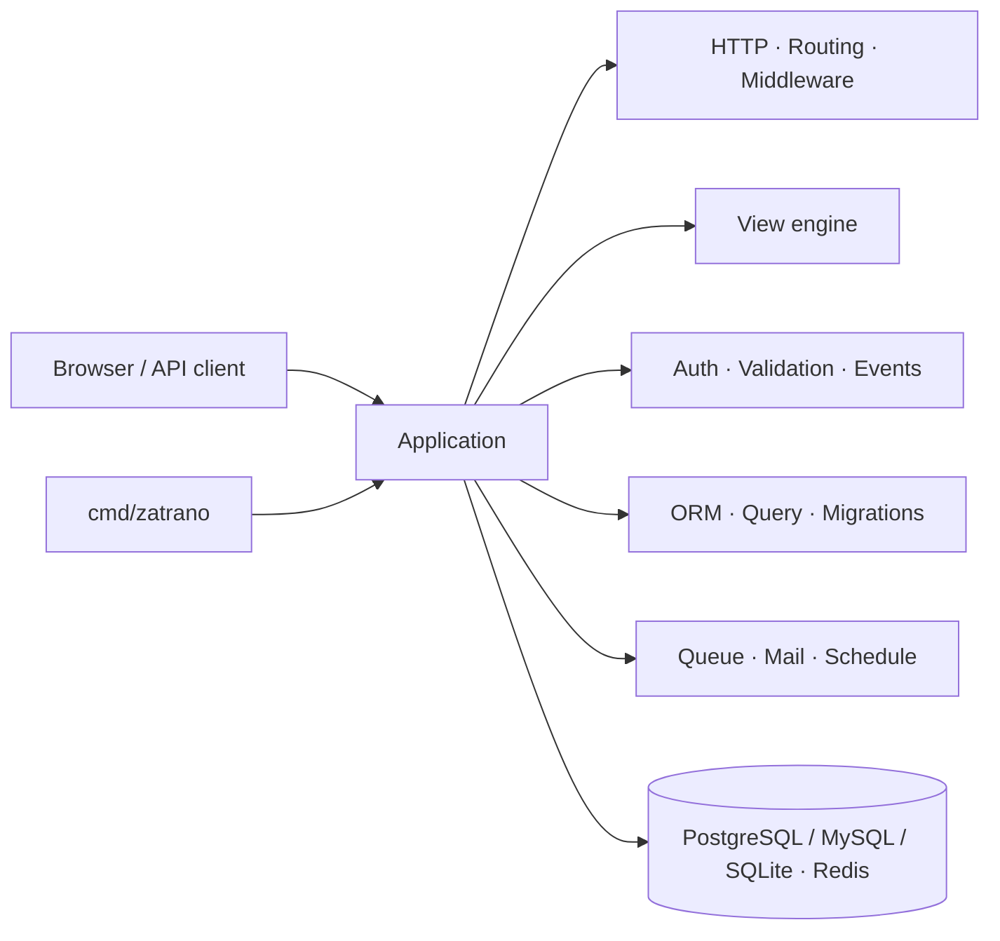

<p align="center">
  <strong>ZATRANO</strong>
</p>

<p align="center">
  <em>Go performance. Batteries-included DX. One opinionated path from request to production.</em>
</p>

<p align="center">
  <a href="https://github.com/zatrano/framework/actions"></a>
  <a href="https://github.com/zatrano/framework/actions"></a>
  <a href="https://github.com/zatrano/framework/actions"></a>
  <a href="https://pkg.go.dev/github.com/zatrano/framework"></a>
  <a href="LICENSE"></a>
  <a href="VERSION"></a>
</p>

<p align="center">
  <a href="https://zatrano.com/docs">Documentation</a> ·
  <a href="https://github.com/zatrano/framework/releases">Releases</a> ·
  <a href="https://github.com/zatrano/framework">GitHub</a>
</p>

## Why ZATRANO?

Most Go web apps start fast and then slow down in the glue: auth, migrations, queues, mail, validation, sessions, CLI, and project structure. ZATRANO ships those as first-party packages under one coherent application skeleton — so you build product, not scaffolding.

- **Expressive HTTP stack** — routing, controllers, middleware, requests/responses, views
- **Full Auth** — register, login, remember me, password reset, email verification, lockout, MFA, multi-device logout, events, guards
- **Persistence that scales with you** — query builder, schema, migrations, ORM, factories, seeders
- **Ops-ready core** — cache, queues, mail, notifications, scheduling, health, maintenance, backups

## Quick start

```bash
go get github.com/zatrano/framework@latest
# or pin a release
go get github.com/zatrano/framework@v0.2.0
```

Clone the skeleton and run it:

```bash
git clone https://github.com/zatrano/framework.git
cd framework
cp .env.example .env
go mod tidy
go run ./cmd/zatrano key:generate
go run ./cmd/zatrano serve
```

Open [http://localhost:8080](http://localhost:8080).

Full guides live in the [documentation](https://zatrano.com/docs).

## What you get

| Area | Capabilities |
|------|----------------|
| **HTTP** | Router, controllers, middleware (CSRF, CORS, throttle, security headers…), form/JSON/multipart input, cookies, flash, URL generation |
| **Views** | Layouts, components, Blade-like directives, nested `@foreach`, markdown, file-based pages |
| **Auth & security** | Guards, remember tokens, password confirmation, email verification, lockout, 2FA, OAuth/WebAuthn/social helpers, encryption, hashing, honeypot, trusted proxies |
| **Data** | Query builder, schema builder, migrations, ORM (relations, scopes, eager load, soft deletes patterns), Mongo helper, API resources / JSON:API |
| **Async & mail** | Queues (DB/Redis), notifications (in-app / mail / SMS, single + bulk CSV/XLSX), broadcasting, scheduler / cron |
| **Platform** | Config + `.env`, sessions, cache (incl. Redis), filesystem, localization, validation, collections, pagination |
| **Tooling** | First-party CLI (`serve`, `migrate`, `make:*`, `about`, …), OpenAPI, GraphQL helpers, docs engine, health checks, observability hooks |

## Architecture



Opinionated layout: `app/`, `bootstrap/`, `config/`, `routes/`, `views/`, `database/`, `storage/`, plus a rich `core/` of framework packages.

## Who is ZATRANO for?

- Teams that want **Go speed** without inventing a new framework on every project
- Builders shipping **server-rendered apps and APIs** with shared conventions
- Engineers who prefer **batteries included** over stitching 20 micro-libraries
- Products that need **auth, jobs, mail, and migrations** on day one

## Learning ZATRANO

Start here: **[zatrano.com/docs](https://zatrano.com/docs)** — installation, HTTP stack, database/ORM, security, packages, and more.

## Roadmap

| Version | Focus |
|---------|--------|
| **v0.2** | Hardening DX, docs depth, starter polish |
| **v0.3** | Broader production recipes (deploy, observability, scaling patterns) |
| **v1.0** | Stable public API surface and long-term support commitment |

Current release: **[v0.2.0](https://github.com/zatrano/framework/releases/tag/v0.2.0)**.

## Community

- GitHub: [github.com/zatrano/framework](https://github.com/zatrano/framework)
- Documentation: [zatrano.com/docs](https://zatrano.com/docs)
- LinkedIn: [linkedin.com/company/zatrano](https://www.linkedin.com/company/zatrano)

## Contributing

Thank you for considering contributing to the ZATRANO framework! Please open an issue or pull request on GitHub. Keep changes focused, include tests when practical, and follow the existing code style (`gofmt`, clear package boundaries).

## Code of Conduct

In order to ensure that the ZATRANO community is welcoming to all, please be respectful in issues, pull requests, and discussions. Harassment and discrimination are not tolerated.

## Security Vulnerabilities

If you discover a security vulnerability within ZATRANO, please send an e-mail to Serhan KARAKOÇ via [serhankarakoc@zatrano.com](mailto:serhankarakoc@zatrano.com). All security vulnerabilities will be promptly addressed.

## License

The ZATRANO framework is open-sourced software licensed under the [MIT license](LICENSE).

Copyright (c) 2026 Serhan KARAKOÇ.
